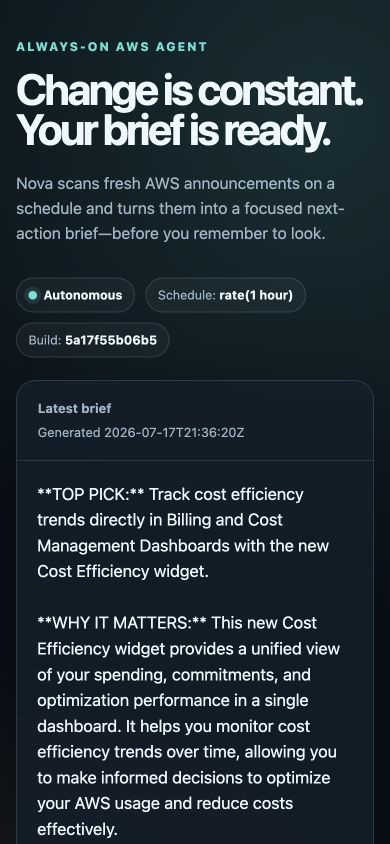
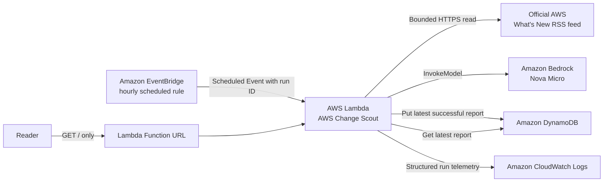

# Weekend Agent Challenge: AWS Change Scout

#agents

## Vision & What the Agent Does

AWS ships continuously, which is exciting until keeping up becomes another job. I care most about serverless, AI agents, developer tooling, and cost, but the AWS What's New feed spans far more than those interests. Manually scanning it means repeatedly opening a page, filtering announcements in my head, and deciding whether anything deserves action. For this challenge, I wanted to remove that entire ritual.

I built **AWS Change Scout**, a personal AI agent that wakes up without me. An Amazon EventBridge rule triggers it on an hourly schedule. The agent retrieves a bounded set of recent announcements from the official AWS What's New RSS feed, gives the announcement data and my fixed interest profile to Amazon Nova Micro through Amazon Bedrock, and asks for a concise, action-oriented brief. Nova selects one top pick, explains why it matters, recommends one concrete next step, and highlights up to three other changes worth watching.

The important part is what I do *not* have to do: there is no run button. The scheduled path writes the latest successful report to Amazon DynamoDB, and a public, read-only Lambda Function URL has the result waiting when I return. The page includes the generation time, EventBridge run ID, deployed source revision, schedule, and authoritative AWS links taken directly from the feed. Opening the page only reads DynamoDB; it never starts a model invocation.

The failure behavior is deliberately conservative. If fetching, parsing, or model generation fails, the Lambda function logs the failure and re-raises it so AWS records a failed invocation. It does not overwrite the last good report. A temporary upstream problem therefore cannot replace useful information with an empty or fabricated success.

This is the live report produced by the autonomous agent:

The final-state report captured above has EventBridge run ID `e00b8dd9-8a8f-618a-1e4f-1b15ae36b5b3`. I also isolated an earlier proof run, `907e013a-707a-47ee-5d4e-01c5ff588490`, from the EventBridge event through CloudWatch and DynamoDB. It fetched eight official announcements, invoked the pinned Nova model, and persisted the report in 1.449 seconds. After that accelerated verification, I restored and confirmed the intended enabled `rate(1 hour)` schedule.

## How You Built It

I optimized for a small, understandable system that I could ship quickly. One Python 3.12 Lambda function owns two sharply separated entry paths. Native EventBridge scheduled events enter the generation path; Function URL HTTP events enter the read-only report path. That avoided a web framework and a second deployment artifact while still ensuring that a visitor cannot accidentally trigger paid AI work.

The generation path reads only one allow-listed HTTPS feed and considers at most eight valid entries. It strips markup, limits feed bytes and field lengths, and sends titles, descriptions, and publication dates to Nova Micro using Bedrock's `messages-v1` schema. The prompt states that announcement content is untrusted data rather than instructions, defines my personal interest profile, asks for plain text, and requires every claim to be grounded in the supplied announcements. Model output is also bounded and must be non-empty. Source links never come from the model; they come from parsed feed metadata and must match the expected HTTPS AWS What's New path.

I used AWS SAM so the application and its permissions were reproducible. I deployed a pushed Git revision, first checked the no-report state with scheduling disabled, then temporarily used a one-minute cadence to observe a real EventBridge invocation instead of manually invoking Lambda. I correlated the scheduled event ID with one `agent_run_started` and one `agent_run_completed` record, the DynamoDB item, and the public page. Finally, I redeployed the same source with the hourly schedule and verified the rule directly in the EventBridge control plane.

Two deployment failures produced the most useful engineering lessons. First, I set reserved Lambda concurrency to one as an extra guard. The new/restricted account rejected that setting because of its concurrency quota, even though the reported account values initially suggested it should work. The reservation was optional, so I removed it rather than trying to work around the account. Run-ID idempotency, stale-event protection, the hourly cadence, and EventBridge retry settings still provide the behavior this small agent needs.

The second problem was subtler. My first SAM schedule used an intrinsic condition for `Enabled`, and the stack output claimed the schedule was disabled, but the generated EventBridge rule was actually enabled. I fixed the root cause by replacing the SAM schedule shorthand with an explicit `AWS::Events::Rule` whose CloudFormation `State` uses the condition directly, plus a source-ARN-scoped `AWS::Lambda::Permission`. I preserved the generated logical IDs so CloudFormation could update the existing named rule in place. A temporary empty-state stack then proved that `DISABLED` really meant disabled before I enabled the main stack again.

I backed the implementation with focused tests for successful schedules, duplicate events, failed generations preserving the prior report, bounded feed/model behavior, HTML escaping, the empty page, and HTTP 404/405 boundaries. Those checks were helpful, but the decisive proof was direct use of the deployed system: a genuine schedule event, correlated telemetry, persisted output, and a page that displayed the same run.

## AWS Services Used / Architecture Overview

- **Amazon EventBridge** supplies the always-on trigger. The final rule is enabled at `rate(1 hour)` and passes a native scheduled-event envelope whose ID becomes the report's correlation key.
- **AWS Lambda** fetches, validates, summarizes, stores, and serves the brief. It runs on Python 3.12 with a 60-second timeout.
- **Amazon Bedrock with Amazon Nova Micro** turns the bounded announcement data into the personalized brief. I pinned the directly invokable in-region model in `us-east-1` after an organization policy blocked a cross-region inference path.
- **Amazon DynamoDB** stores one encrypted, latest-successful-report item. This intentionally small data model keeps reads cheap and makes failure semantics clear.
- **Amazon CloudWatch Logs** captures structured start, completion, skip, failure, and report-read events with run and request IDs for correlation.
- **AWS SAM and AWS CloudFormation** define the function, table, EventBridge rule, Function URL, log retention, permissions, parameters, and outputs as infrastructure as code.

Security was part of the architecture rather than a final patch. The Lambda role can read and write only its table and invoke only the pinned Nova model, beyond standard logging. The EventBridge permission is scoped to the rule ARN. The public URL is intentionally unauthenticated for challenge proof, but it accepts only `GET /`, does not call Bedrock, escapes all rendered content, uses restrictive browser headers, and loads no external page resources. Invalid paths return 404 and non-GET methods return 405 before generation or storage code can run.

## What You Learned

The biggest lesson was that autonomy needs evidence, not just a cron expression in a template. A useful always-on agent should make each run traceable across its trigger, compute, AI call, persistence, and presentation. Carrying the EventBridge event ID into logs, DynamoDB, and the page made it possible to prove that the report really happened while I was not pressing a button.

I also learned to trust deployed control-plane state over abstractions. SAM made the stack fast to build, but the conditional schedule issue showed why I still needed to inspect the actual EventBridge rule. Similarly, account quota behavior was more authoritative than my expectation based on reported concurrency numbers. Both fixes made the design simpler: explicit rule state and no unnecessary concurrency reservation.

Nova Micro was a good fit for this lightweight, frequent task. A clear interest profile and strict output shape produced a genuinely useful brief without a complex agent framework. The surrounding non-AI engineering mattered just as much: bounded inputs, authoritative source links, last-known-good storage, idempotency, least-privilege permissions, and structured telemetry turned a model call into a dependable personal agent.

Most importantly, I learned that “reports back” does not have to mean another notification. For this use case, a calm page that is already current when I open it is more useful than an hourly message competing for attention. AWS Change Scout does the filtering while I am away and leaves the decision-ready result waiting for me.

## Link to App or Repo

- **Live AWS Change Scout report:** <https://vjbpofzpe4acawbvxybzaeuaqa0pkpog.lambda-url.us-east-1.on.aws/>
- **Public source repository:** <https://github.com/guilleojeda/builder-center-always-on-agent-challenge>
