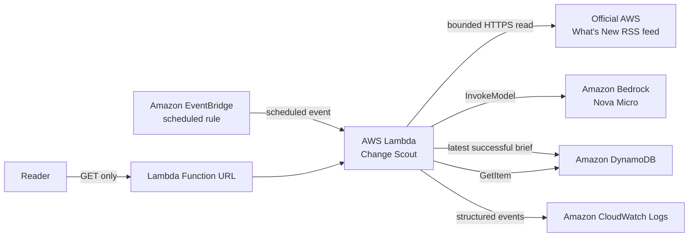

# AWS Change Scout

AWS Change Scout is an always-on personal agent for builders who care about serverless, AI agents, developer tooling, and cost. An Amazon EventBridge rule wakes it hourly; it reads a bounded set of recent entries from the official AWS What's New feed, asks Amazon Nova Micro for an action-oriented brief, and stores the latest successful result. A public, read-only Lambda Function URL serves that brief with its run ID, generation time, and authoritative source links. There is no run button.

If a feed or model call fails, Lambda reports the failure to CloudWatch and leaves the previous successful brief untouched.

**Live report:** _Pending deployment. Replace this line with the CloudFormation `PublicReportUrl` stack output._

**Source:** <https://github.com/guilleojeda/builder-center-always-on-agent-challenge>

## Architecture



AWS SAM provisions the Lambda function, its public Function URL, the EventBridge rule, an on-demand encrypted DynamoDB table, least-privilege IAM statements, and a log group with seven-day retention. Scheduled requests generate reports; HTTP requests only read the stored report and never invoke the model.

## Prerequisites

- Python 3.12 with `boto3`, plus Git
- AWS CLI and AWS SAM CLI
- AWS credentials available through the normal AWS credential chain; never place credentials in this repository
- Permission in `us-east-1` to deploy CloudFormation/SAM resources and use Lambda, IAM, EventBridge, DynamoDB, CloudWatch Logs, S3 packaging, and Amazon Bedrock
- Access to `amazon.nova-micro-v1:0` in `us-east-1`, plus an account policy that permits a public Lambda Function URL
- A committed and pushed revision so `BuildSha` identifies the exact deployed source

## Local checks

The tests use local fakes; they do not call AWS or the live RSS feed.

```bash
python3 -m unittest discover -s tests -v
python3 -m compileall src tests
sam validate --lint
sam build
```

## Deploy with AWS SAM

Deploy the pushed revision first with the rule disabled. This makes the autonomous empty state directly observable before the first report exists.

```bash
STACK_NAME=aws-change-scout
BUILD_SHA="$(git rev-parse HEAD)"

sam build
sam deploy \
  --stack-name "$STACK_NAME" \
  --region us-east-1 \
  --resolve-s3 \
  --capabilities CAPABILITY_IAM \
  --no-confirm-changeset \
  --no-fail-on-empty-changeset \
  --parameter-overrides \
    BuildSha="$BUILD_SHA" \
    ScheduleEnabled="false" \
    ScheduleExpression="rate(1 hour)"
```

Get the public URL from the stack output and open it. It should say that it is waiting for its first scheduled run.

```bash
PUBLIC_REPORT_URL="$(aws cloudformation describe-stacks \
  --stack-name "$STACK_NAME" \
  --region us-east-1 \
  --query "Stacks[0].Outputs[?OutputKey=='PublicReportUrl'].OutputValue" \
  --output text)"

curl --fail --silent --show-error "$PUBLIC_REPORT_URL"
```

For a quick proof of autonomous operation, enable the allowed one-minute verification cadence. Do not invoke Lambda manually: wait for EventBridge to create the report.

```bash
sam deploy \
  --stack-name "$STACK_NAME" \
  --region us-east-1 \
  --resolve-s3 \
  --capabilities CAPABILITY_IAM \
  --no-confirm-changeset \
  --no-fail-on-empty-changeset \
  --parameter-overrides \
    BuildSha="$BUILD_SHA" \
    ScheduleEnabled="true" \
    ScheduleExpression="rate(1 minute)"
```

After a scheduled report appears, restore the intended hourly cadence:

```bash
sam deploy \
  --stack-name "$STACK_NAME" \
  --region us-east-1 \
  --resolve-s3 \
  --capabilities CAPABILITY_IAM \
  --no-confirm-changeset \
  --no-fail-on-empty-changeset \
  --parameter-overrides \
    BuildSha="$BUILD_SHA" \
    ScheduleEnabled="true" \
    ScheduleExpression="rate(1 hour)"
```

## Verify the deployed agent

1. Open `PublicReportUrl` in a browser. Confirm the brief, official AWS source links, timestamp, run ID, hourly schedule, and deployed SHA prefix are visible; also check a narrow/mobile viewport. The `DeployedBuildSha` stack output contains the full SHA.
2. Confirm the final rule is enabled with `aws events describe-rule --name "$STACK_NAME-hourly" --region us-east-1`.
3. Inspect `aws logs tail "/aws/lambda/$STACK_NAME-agent" --region us-east-1 --since 10m --format short`. A successful autonomous run has matching `agent_run_started` and `agent_run_completed` records and no `agent_run_failed` for that run ID.
4. Read the stored item with the `ReportTableName` stack output and `aws dynamodb get-item --table-name <table-name> --key '{"pk":{"S":"LATEST"}}' --region us-east-1`. Its `run_id` should match the page and logs.
5. Confirm `GET /missing` returns 404 and `POST /` returns 405. Neither request should produce a model invocation or DynamoDB write.

## Security and cost

The agent only fetches one fixed HTTPS AWS feed, bounds feed and model output sizes, treats announcement text as untrusted data, validates source URLs, escapes rendered content, and sends restrictive browser security headers. Beyond basic log delivery, its role can only read/write the one table and invoke the pinned Nova model. The public endpoint is intentionally unauthenticated, but it is read-only and never generates a report.

This stack can incur charges for Bedrock inference, Lambda compute and requests, EventBridge, DynamoDB on-demand reads/writes, CloudWatch Logs, and SAM packaging storage. Free Tier eligibility and promotional credits vary. Reserved Lambda concurrency is one, the normal generation cadence is hourly, and logs expire after seven days; heavy public traffic can still create Lambda/DynamoDB read costs and temporarily delay a scheduled run. That tradeoff is suitable for this small public challenge proof, not a high-traffic production service.

## Teardown

Delete the CloudFormation stack and SAM-managed artifacts when finished:

```bash
sam delete --stack-name aws-change-scout --region us-east-1 --no-prompts
```
